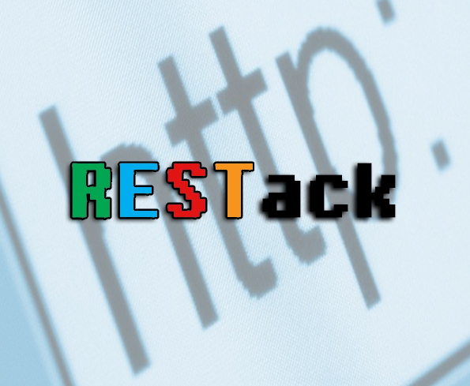

<div align="center">
  <h1><strong> ⬆️ RESTack API ⬇️ </strong></h1>
  
</div>

<br/>

**RESTack** is an experimental REST API developed exclusively for educational purposes.

Currently, there are some different operations that can be performed, such as a CRUD for users and projects through a Many-To-Many association. Furthermore, there are some rules for route access, e.g. only authenticated users can create, update and delete projects/users, but retrieving them is allowed for everyone.

---

## :toolbox: Tools & Dependencies

- Node.js
- Express
- PostgreSQL
- Sequelize
- JWT
- Bcrypt
- Body Parser
- Cookie Parser
- ESLint
- Prettier
- Insomnia
- DBeaver

---

## ♾️ Helpful Content

[HTTP response status codes (MDN Web Docs)](https://developer.mozilla.org/en-US/docs/Web/HTTP/Status)

---

## ✅ Installation & Execution

First of all, configure the `.env` file with the information related to secrets and database configuration:

```
JWT_SECRET=#
PG_PASSWORD=#
PROJECT_NAME=restack
ADMIN=#
HOST=localhost
DIALECT=postgres
```

Then, run the following command to install the dependencies from _package.json_:

`yarn install`

Run the migration from Sequelize:

`sequelize db:migrate`

Finally, start the project with:

`yarn start`

---

## ▶️ Examples

**POST** @ _http://localhost:3000/signup_

Used to create a new user with `name`, `email` and `password`. Returns the user's info or an error message (e.g. `email` already exists).


<br/>

**POST** @ _http://localhost:3000/login_

Used to authenticate the user using `email` and `password`. Generates a cookie with the user credentials (JSON Web Token), necessary to manage the projects. If there is some wrong information a message is sent back.


<br/>

**GET** @ _http://localhost:3000/user_

Used to retrieve all the _users_ from the database.


<br/>

**GET** @ _http://localhost:3000/project_

Used to retrieve all the _projects_ from the database.


<br/>

**GET** @ _http://localhost:3000/user/id_

Used to retrieve a _user_ by its `id`, or a message if it not exists.


<br/>

**GET** @ _http://localhost:3000/project/id_

Used to retrieve a _project_ by its `id`, or message if it not exists.


<br/>

**POST** @ _http://localhost:3000/project/id/add_user_

Used to add a _user_ to a _project_ through the project's `id`.


<br/>

**POST** @ _http://localhost:3000/user/id/add_project_

Used to add a _project_ to a _user_ through the user's `id`.


<br/>

Some other routes available are:

- **POST** @ _http://localhost:3000/project_: Create new project with `name`, `stack`

- **PUT** @ _http://localhost:3000/project/id_: Update existing project by `id`

- **PUT** @ _http://localhost:3000/user/id_: Update existing user by `id`

- **DELETE** @ _http://localhost:3000/project/id_: Delete project by `id`

- **DELETE** @ _http://localhost:3000/user/id_: Delete user by `id`

<br/>

An important aspect of **RESTack** is the user authentication, necessary to perform some actions, such as create a project:


